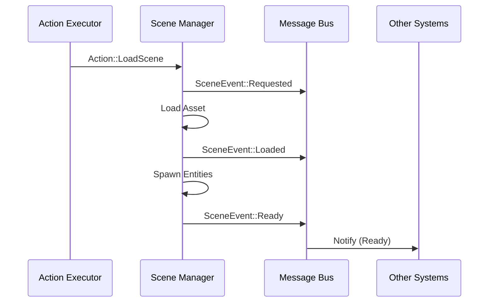

# Architecture

## Current state (today)
- `ironhold_core`: core Bevy plugin(s), RON asset types, scene spawning, player controller, orbit camera, animation mapping, UI button → scene load.
- `ironhold_native`: desktop runner calling `ironhold_core::start_app()`; selects project via `--project <name>` CLI arg.
- `ironhold_web`: WASM runner exposing `start()` via wasm-bindgen; reads `?project=<name>` from the page URL and passes it to `start_app`.

## Internal Structure
The `ironhold_core` crate is organized into modular sub-modules to maintain separation of concerns:
- **`schema/`**: Data types and RON deserialization logic (e.g., `ProjectConfig`, `GameLevel`).
- **`runtime/`**: Core engine logic, including the Message/Action interpreter and the `SceneManager`.
- **`capabilities/`**: Reusable gameplay systems (e.g., `CharacterController`, `OrbitCamera`).
- **`utils.rs`**: Shared utility functions like asset folder discovery.

### DebugState resource
`DebugState` (defined in `lib.rs`) is a plain resource updated every `PostUpdate` frame by `update_debug_state`:

| Field | Content |
|-------|---------|
| `frame` | Frame counter (monotonically increasing) |
| `app_state` | Current `AppState` variant as a string (e.g. `"InGame"`) |
| `last_action` | Debug repr of the last `Action` dispatched by `action_executor_system` |
| `scene` | Asset path of the most recently fully-loaded scene (from `SceneEvent::Ready`) |

On WASM, a second system (`sync_debug_state_to_dom`, compiled only for `wasm32`) serialises this to JSON and writes it into `
` in the page, making it readable by browser automation (see `test_web.py`).

Assets:
- `assets/project.ron`: selects initial scene.
- `assets/scenes/*.ron`: describe the scene contents (models, player config, UI).

## Target architecture (planned) 🧭
- 🧭 Deterministic simulation core (fixed tick)
- 🧭 Event bus with stable message schema
- 🧪 Action executor (exists, limited set of actions)

### Scene Lifecycle (Sequence)
The transitions between states and the messages emitted are visualized below:

**Messages (events) → Interpreter (data logic) → Actions → Executors**

- **Event producers** (input/UI/triggers/etc.) emit Messages.
- **Interpreter** reads Messages + current state (global/per-entity) and emits Actions.
- **Executors** apply Actions via capability systems.

Why:
- Enables data-defined behavior without recompiling.
- Decouples features (UI doesn’t hardcode scene management).
- Prepares the engine for deterministic simulation and multiplayer later.

## Layering
### App-level flow (global)
Use Bevy app States for lifecycle:
Boot → LoadingProject → LoadingScene → InGame → Paused / Error

### Gameplay logic (data-driven)
- Global logic: “project-level” state machine(s) (e.g., menus, cutscenes).
- Entity logic: behavior machines attached to entities (e.g., door logic, NPC logic, locomotion).

### Capabilities
Capability modules provide:
- event sources (e.g., input mapping)
- action executors (e.g., Move, PlayAnimation, LoadScene)
- data schemas and validation
