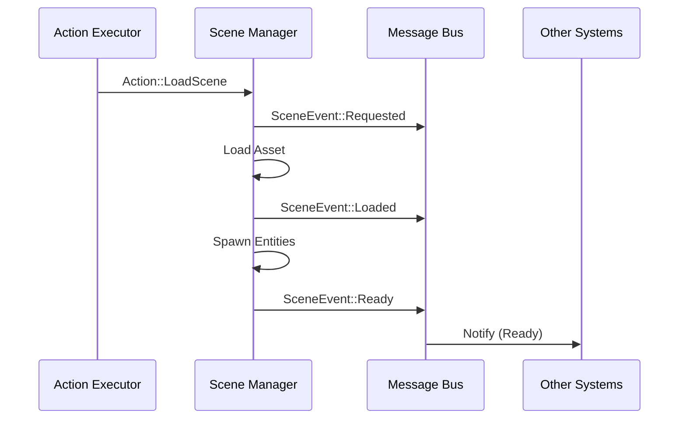

# Architecture

## Current state (today)
- `ironhold_core`: RON-driven scene pipeline, player controller, orbit camera, fly camera, animation, animation resolver, NPC AI, collectible triggers, motion (rotate/bob), custom WGSL material, terrain mesh + material, physics (Rapier3D), FSM-based and rules-based logic interpreters, full Message → Interpreter → Action → Executor pipeline.
- `ironhold_native`: desktop runner calling `ironhold_core::start_app()`; selects project via `--project <name>` CLI arg.
- `ironhold_web`: WASM runner exposing `start()` via wasm-bindgen; reads `?project=<name>` from the page URL and passes it to `start_app`.

## Internal Structure
The `ironhold_core` crate is organized into modular sub-modules to maintain separation of concerns:
- **`schema/`**: Data types and RON deserialization logic (e.g., `ProjectConfig`, `GameSceneV2`, `AssetCatalog`).
- **`runtime/`**: Core engine logic, including the Message/Action interpreter and the `SceneManager`.
- **`capabilities/`**: Reusable gameplay systems: `player`, `camera` (orbit), `flycam`, `animation`, `animation_resolver`, `npc`, `collectible`, `motion`, `custom_material`, `terrain`, `terrain_material`, `physics`, `spin`.
- **`utils.rs`**: Shared utility functions, including asset folder discovery.

### Assets folder discovery

The runtime expects an `assets/` directory relative to the executable's working directory. `utils.rs` walks up parent directories until it finds an `assets/` folder, so running from the workspace root (`cargo run`) always works even when the compiled binary lives in a nested `target/` path. The WASM runner serves assets from the same origin as the page — no walking needed in the browser.

### DebugState resource
`DebugState` (defined in `lib.rs`) is a plain resource updated every `PostUpdate` frame by `update_debug_state`:

| Field | Content |
|-------|---------|
| `frame` | Frame counter (monotonically increasing) |
| `app_state` | Current `AppState` variant as a string (e.g. `"InGame"`) |
| `last_action` | Debug repr of the last `Action` dispatched by `action_executor_system` |
| `scene` | Asset path of the most recently fully-loaded scene (from `SceneEvent::Ready`) |
| `logic_state` | Current named logic state set by `Action::EnterState`; empty string means stateless |
| `score` | Running score total, derived from `GameVariables["score"]` each frame |

On WASM, a second system (`sync_debug_state_to_dom`, compiled only for `wasm32`) serialises this to JSON and writes it into `
` in the page, making it readable by browser automation (see `test_web.py`).

Assets are organized per-project under `assets/projects/{name}/`. See root `CLAUDE.md` for the full layout.

## Target architecture (planned) 🧭
- 🧭 Deterministic simulation core (fixed tick)
- ✅ Event bus with stable message schema
- ✅ Action executor (fully wired; see Engine ABI in `docs/STATUS.md` for the complete action set)

### Scene Lifecycle (Sequence)
The transitions between states and the messages emitted are visualized below:

**Messages (events) → Interpreter (data logic) → Actions → Executors**

- **Event producers** (input/UI/triggers/etc.) emit Messages.
- **Interpreter** reads Messages + current state (global/per-entity) and emits Actions.
- **Executors** apply Actions via capability systems.

Why:
- Enables data-defined behavior without recompiling.
- Decouples features (UI doesn’t hardcode scene management).
- Prepares the engine for deterministic simulation and multiplayer later.

## Material and Shader Pipeline ✅

Three material types are available. Choose the simplest one that fits:

| Type | Use when | Shader |
|------|----------|--------|
| `Standard` | PBR mesh with texture maps and no custom logic | Bevy built-in |
| `Terrain` | Heightmap terrain with 3-layer splatmap blending | `assets/shared/shaders/terrain.wgsl` |
| `Custom` | Any effect not achievable with Standard (procedural, unlit, rim, etc.) | Designer-supplied `.wgsl` |

### Custom WGSL shader pipeline ✅

`CustomMaterial` is the WGSL extension point. It is fully data-driven:

1. Author a `.wgsl` fragment shader in `assets/shared/shaders/` (or a project subfolder).
2. Declare the material in `assets.ron` — set `shader`, `colors`, `floats`, and `textures`.
3. Reference the material key from a prefab definition (`material: Some("key")`).
4. The engine packs uniforms, loads the shader via the asset server, and creates the GPU pipeline automatically.

Each unique shader handle produces a separate GPU render pipeline (Bevy's material specialisation). Materials sharing the same shader share the same pipeline.

**Fragment-only today.** `CustomMaterial::specialize()` overrides the forward fragment pass only. Vertex shader override and compute shaders are planned extensions.

See `docs/25_custom_shaders.md` for the full authoring guide, binding contract, and uniform packing rules.

### Why WGSL ✅

WGSL is the native language of WebGPU. Using it directly means:
- No shader transpilation cost at runtime.
- Identical GPU output on desktop (wgpu) and browser (WebGPU).
- No LUT-texture dependencies — all shaders in this engine work without look-up tables, which is required for consistent web performance.

This aligns with the rendering philosophy: web builds are the performance baseline; all platforms render identically.

---

## Layering
### App-level flow (global)
Use Bevy app States for lifecycle:
Boot → LoadingProject → LoadingScene → InGame → Paused / Error

### Gameplay logic (data-driven)
- Global logic: “project-level” state machine(s) (e.g., menus, cutscenes).
- Entity logic: behavior machines attached to entities (e.g., door logic, NPC logic, locomotion).

### Capabilities
Capability modules provide:
- event sources (e.g., input mapping)
- action executors (e.g., Move, PlayAnimation, LoadScene)
- data schemas and validation
